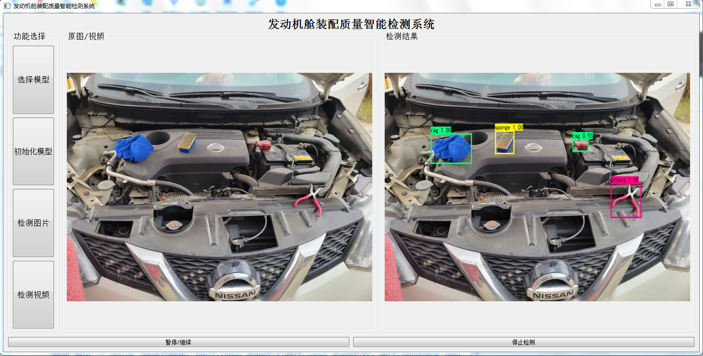

# 发动机舱装配质量智能检测系统
> 实现目标：
  ① 发动舱内微小线划痕检测；
  ② 发动舱内异物检测；
  ③ 发动舱内线距离参数检测。




## 使用范例


Windows:

```sh
python win_main.py
```

## 模型下载
模型下载后，放到weight文件夹下
target1:
    链接：https://pan.baidu.com/s/16i7EAcooFf866v5Ao96Pog 
    提取码：qzqk 

target2:
    链接：https://pan.baidu.com/s/17GNOMdNL1H_Ws6RBYfMJ_g 
    提取码：90vj 


## 版本历史

* 0.0.1
    * 基本实现target2内容


## 贡献代码

1. Fork it (<https://github.com/LYXRhythm/Engine-Project>)
2. Create your feature branch (`git checkout -b feature/newBranch`)
3. Commit your changes (`git commit -am 'Add some newBranch'`)
4. Push to the branch (`git push origin feature/newBranch`)
5. Create a new Pull Request


